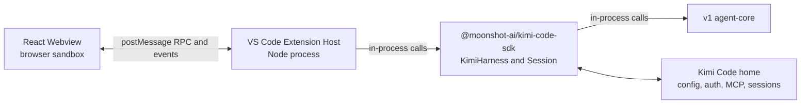

# VS Code Node SDK Migration Design

Status: accepted and implemented for extension `0.6.0`

Last updated: 2026-07-16

## Context

The `0.5.x` VS Code extension launched a separately installed Python Kimi CLI
and communicated with it over stdio. That architecture duplicated runtime
installation, configuration, authentication, and session behavior between the
editor and Kimi Code.

Version `0.6.0` moves the extension into this monorepo under `apps/vscode` and
runs the stable TypeScript v1 engine through `@moonshot-ai/kimi-code-sdk` in the
VS Code Extension Host. The migration preserves the existing extension ID,
commands, Webview, and user-visible workflows. It does not redesign the UI or
introduce unrelated TUI features.

This document records the durable design decisions behind that migration. It
is not a release checklist or a transcript of the implementation process.

## Goals

- Keep the extension ID `moonshot-ai.kimi-code` so `0.6.0` upgrades existing
  installations.
- Preserve the existing VS Code commands, shortcuts, Webview workflows, editor
  integration, session management, MCP management, and file changes panel.
- Replace the Python/stdio host with the in-process v1 Node SDK.
- Share Kimi Code configuration, authentication, MCP configuration, and
  sessions with the TUI when both processes resolve the same Kimi Code home.
- Reuse the shared legacy migration package instead of maintaining a VS
  Code-specific session translator.
- Add only the smallest SDK/core APIs needed to preserve existing VS Code
  behavior.
- Package and test platform-targeted VSIX artifacts for macOS, Linux, and
  Windows.

The only intentional UI capability added during the migration is
model-aware thinking effort selection. It is necessary to represent the model
capabilities exposed by the v1 configuration.

## Non-goals

- Replacing the React Webview with VS Code native views or Chat Participants.
- Migrating to the v2 engine.
- Adding TUI-only features such as goals, cron, swarm, or BTW.
- Keeping a Python CLI fallback or a custom executable setting.
- Adding cross-process locks for concurrent access to one session.
- Making the core wait for VS Code before file tools execute.
- Parsing arbitrary shell commands to infer file changes.
- Copying legacy OAuth or MCP OAuth credentials.
- Publishing an extension as part of the build or package commands.

## Runtime architecture

There is no Python process, secondary Node process, or local HTTP server in the
production extension path.

The Webview remains because it is the existing product UI. It cannot import the
Node SDK directly: the Webview is a browser sandbox and must not access the file
system, credentials, process environment, or session storage. Those operations
stay in the trusted Extension Host.

### Extension identity

The runtime constructs the SDK client with:

- `userAgentProduct: "kimi-code-vscode"`
- `version` from `apps/vscode/package.json`
- `uiMode: "vscode"`

For `0.6.0`, the normal HTTP User-Agent product is therefore
`kimi-code-vscode/0.6.0`. The version has one source of truth and is not copied
into runtime code or packaging scripts.

### Package boundaries

- `apps/vscode` depends on `@moonshot-ai/kimi-code-sdk`.
- `apps/vscode` must not depend directly on `@moonshot-ai/agent-core`.
- Core capabilities needed by released clients are exposed through the Node SDK
  and tested at that public boundary.
- The Webview communicates only through the typed bridge in
  `apps/vscode/shared`.

## Main components

| Area | Primary implementation |
|---|---|
| Activation and VS Code commands | `apps/vscode/src/extension.ts` |
| Webview lifecycle | `apps/vscode/src/KimiWebviewProvider.ts` |
| Webview RPC boundary | `apps/vscode/src/bridge-handler.ts`, `apps/vscode/src/handlers` |
| SDK host | `apps/vscode/src/runtime/kimi-runtime.ts` |
| Session lifecycle and event routing | `apps/vscode/src/runtime/session-runtime.ts` |
| SDK-to-Webview event conversion | `apps/vscode/src/runtime/event-adapter.ts` |
| Session replay | `apps/vscode/src/runtime/replay-adapter.ts` |
| File changes and baselines | `apps/vscode/src/managers` |
| Legacy migration coordination | `apps/vscode/src/migration` |
| React UI | `apps/vscode/webview-ui` |
| Packaging and smoke tests | `apps/vscode/scripts`, `.github/workflows/ci.yml` |

## Data ownership

### Shared Kimi Code home

The SDK resolves the home directory using the normal Kimi Code rules:

1. system-level `KIMI_CODE_HOME`, when set;
2. otherwise `~/.kimi-code`.

The extension does not add a separate `kimi.homeDir` setting and does not pass
its own default home to the SDK. VS Code and the TUI share the following data
only when they resolve the same home:

- `config.toml`
- `mcp.json`
- authentication state
- `sessions/`
- `session_index.jsonl`
- other SDK-owned Kimi Code data

Remote SSH, WSL, and Dev Container installations use the environment and home
of the remote Extension Host. They do not automatically share the local
machine's Kimi Code home.

### VS Code-owned state

VS Code settings and Extension Host storage own editor-specific behavior:

- autosave and keyboard behavior;
- thinking display preferences;
- editor context injection mode;
- Webview state;
- file change baselines and legacy baseline acceptance markers.

These values are not written into the shared core configuration unless they
are already a shared product setting, such as the selected model or thinking
effort.

### Environment variables

The old `kimi.environmentVariables` setting existed to populate the environment
of the Python child process. It was removed with that process model.

- Provider-specific environment variables remain in `config.toml`.
- MCP server environment variables remain in `mcp.json`.
- proxy and other process-level variables are inherited from the Extension
  Host environment.
- a legacy `KIMI_SHARE_DIR` in the removed setting is consulted only as an
  additional migration source.
- other values from the removed global environment map are not migrated.

## Webview bridge

The bridge keeps the request/response and event-broadcast shape of the previous
extension so the React UI did not require a product redesign. The Extension
Host validates method names, payloads, workspace containment, and file paths.
The Webview uses a nonce-based content security policy and does not receive
tokens, complete configuration files, or unnecessary absolute paths.

The event adapter maps v1 SDK events such as `turn.started`,
`assistant.delta`, `tool.call.started`, approvals, questions, compaction, and
errors into the UI state expected by the migrated Webview. Session replay uses
the SDK/core replay surface rather than parsing current core storage directly
from the UI.

Provider errors may arrive after a failed turn-end event. Session subscriptions
therefore remain alive long enough to deliver the final error instead of being
cancelled immediately when a turn ends.

## Sessions

The Node SDK exposes the session operations required by the existing editor UI:

- create, resume, list, rename, and export;
- permanent delete;
- fork from a selected historical turn;
- replayed context and records needed to restore the UI;
- approval, question, stop, steer, plan mode, model, and thinking controls.

Permanent delete keeps the old VS Code meaning; it is not silently mapped to
archive. A running target session is stopped and closed before its persisted
data and index references are removed.

Historical fork keeps the selected turn and its preceding context, then removes
later conversation state. Baselines are materialized into the fork so Keep or
Undo actions in one session cannot affect the other.

The TUI and VS Code may resume sessions created by each other. They must not run
the same session concurrently because the v1 store has no cross-process write
lock.

## Provider-aware models and thinking

Model aliases retain their provider identity. The picker groups models by
provider when multiple providers are configured, so same-named models remain
distinct. Media fallback prefers a compatible model from the current provider
before considering another provider.

Thinking controls follow each model's declared capabilities:

- models with `support_efforts` expose those effort values;
- boolean-thinking models expose on/off;
- `always_thinking` models do not expose an invalid off state;
- adaptive-thinking capability is preserved when applying the selection.

Changing the model or thinking effort updates the active session and the shared
default configuration used by new TUI and VS Code sessions.

## MCP

Home-level MCP operations are exposed by the SDK harness rather than by direct
file access from the extension. They cover configuration CRUD, OAuth/reset,
connection testing, and user-global `mcp.json` entries. Session-level status and
reconnect behavior remain on the Session surface.

The extension supports stdio and HTTP servers, including their environment,
headers, and authorization flows. Legacy MCP OAuth credentials are not copied
and may require authorization after upgrade.

## Legacy migration

Migration is opt-in and uses `@moonshot-ai/migration-legacy` for detection and
translation. The extension coordinates prompts and reports but does not
maintain another config/session translator.

### Sources and target

- default source: `~/.kimi`;
- optional additional source: a valid legacy `KIMI_SHARE_DIR` from the removed
  VS Code setting;
- target: the SDK-resolved Kimi Code home.

Migration covers the shared config, MCP config, user history, supported skills,
and sessions. Existing target data wins according to the shared migration
package's conflict rules. Migration is repeatable and does not delete the
legacy source.

On first launch, the extension detects work without mutating either home and
offers **Migrate now** or **Later**. The command
`Kimi Code: Migrate Legacy Data` remains available for manual runs and retries.

The shared marker `.migrated-to-kimi-code` can contain multiple target homes.
This prevents duplicate migration when the TUI migrated the same source first,
while still allowing a different `KIMI_CODE_HOME` to be migrated later.

Migrated sessions keep source metadata in `state.json.custom`, including the
legacy source path and session identity. This metadata also supports legacy
baseline fallback.

OAuth and MCP OAuth credentials are intentionally not copied. Refresh tokens
may rotate, so copying them can invalidate one installation or create ambiguous
ownership. The upgrade flow and release notes must tell users to authorize
again when needed.

## File changes and baselines

The baseline feature exists only to support the VS Code File Changes panel,
diff view, Keep Changes, and Undo. It is not core session state and is not a TUI
feature.

### New sessions

Baselines are stored under the extension's `globalStorage`, namespaced by the
resolved Kimi Code home and session ID. The home namespace prevents sessions
with the same ID in different homes from sharing baseline state.

The session runtime observes `tool.call.started` for the explicit `Write` and
`Edit` tools. It captures the first pre-change content for each file and
refreshes the File Changes panel after tool results. A missing original file is
represented as a newly created file.

- **Keep** removes the effective baseline entry from the panel.
- **Undo** restores the original content or deletes a file that did not exist.
- keeping a file and editing it again starts a new baseline period.
- all paths are resolved against the session work directory and checked for
  traversal and symlink escape.

This is intentionally best-effort. The core does not pause tool execution for a
VS Code callback, and arbitrary Bash file mutations are not tracked.

### Migrated sessions

Legacy baselines are not copied in bulk. A migrated session uses its recorded
legacy source path and reads `<legacy-session>/baseline` as a read-only
fallback.

The lookup order is:

1. extension-owned baseline;
2. an extension-owned marker saying a legacy path was accepted;
3. the legacy baseline.

Keeping a legacy change writes the acceptance marker instead of deleting old
data. Forking materializes the currently effective baseline into the target
session's extension storage. If the user deletes the legacy home, the migrated
conversation remains usable but legacy diff/Undo information is no longer
available.

## Packaging and CI

The Webview and Extension Host are separate build products:

- Vite builds browser assets for the Webview.
- the Extension Host bundle includes the Node SDK and v1 runtime; only VS Code
  host modules remain external.

The production VSIX excludes tests, fixtures, source maps, local profiles,
sessions, caches, logs, tokens, and the old Python/stdio runtime. Package audit
checks the manifest, assets, unresolved runtime imports, and sensitive files
after test state has been created.

The extension produces six target artifacts:

- `darwin-x64`, `darwin-arm64`
- `linux-x64`, `linux-arm64`
- `win32-x64`, `win32-arm64`

The CI matrix builds and audits the target VSIX files. Installed-extension smoke
tests run on Linux, macOS, and Windows x64 runners. Linux checks the declared
minimum VS Code version and stable; macOS and Windows check the declared
minimum. Architecture targets without a matching runner remain package/audit
evidence rather than runtime E2E evidence.

Packaging never publishes. Marketplace and Open VSX publication require a
separate authorized release action.

## Validation snapshot

The migration was validated with:

- package-local tests for the extension, Node SDK, v1 core, and legacy
  migration;
- real temporary homes and workspaces for migration and baseline behavior;
- provider-aware model, identity, MCP, error, session replay, delete, and fork
  contract tests;
- production Extension Host and Webview builds;
- six target VSIX package audits;
- an upgrade from the released `0.5.10` extension to local `0.6.0` in an
  isolated profile;
- installed VSIX Extension Host smoke on Linux, macOS, and Windows x64 CI;
- local installed `darwin-arm64` VSIX smoke on VS Code `1.100.0`;
- repository lint, typecheck, tests, Nix build, workspace sync, changeset
  status, and whitespace checks.

All automated CI checks for the migration branch were green when this document
was finalized.

## Known limitations and release gates

- Remote SSH, WSL, and Dev Container behavior follows `extensionKind:
  ["workspace"]` and remote home resolution, but still needs representative
  release-candidate smoke in a real remote environment.
- Cursor installation, activation, Webview, and basic chat require a usable
  Cursor environment; VS Code smoke is not a substitute.
- A release candidate should receive one real-account auth/provider smoke in a
  workspace containing no sensitive files.
- Migrated nested subagents preserve the parent call/summary but cannot recreate
  every child prompt, step, tool, and approval detail from the legacy format.
- Legacy OAuth and MCP OAuth require reauthorization.
- Bash-based deletes and arbitrary external file edits are outside baseline
  tracking.
- Concurrent writes to one session from multiple processes are unsupported.
- The package script uses a pinned `@vscode/vsce` programmatic `pack()` entry;
  upgrading that package requires revalidating the packaging contract.

## Maintenance invariants

Future changes must preserve these boundaries unless a new design explicitly
replaces them:

1. The Webview never imports the Node SDK or gains direct Node/file/auth access.
2. `apps/vscode` never imports v1 agent-core directly.
3. Shared config and sessions live in the SDK-resolved Kimi Code home; editor
   preferences and baselines remain VS Code-owned.
4. Legacy migration translation stays in `packages/migration-legacy`.
5. Session storage is accessed through SDK/core APIs, not parsed or mutated by
   the Webview.
6. Baselines remain an extension compatibility layer and do not make core tool
   execution wait for VS Code.
7. Package-only evidence is not reported as runtime E2E evidence.
8. Build/package commands do not publish artifacts.
